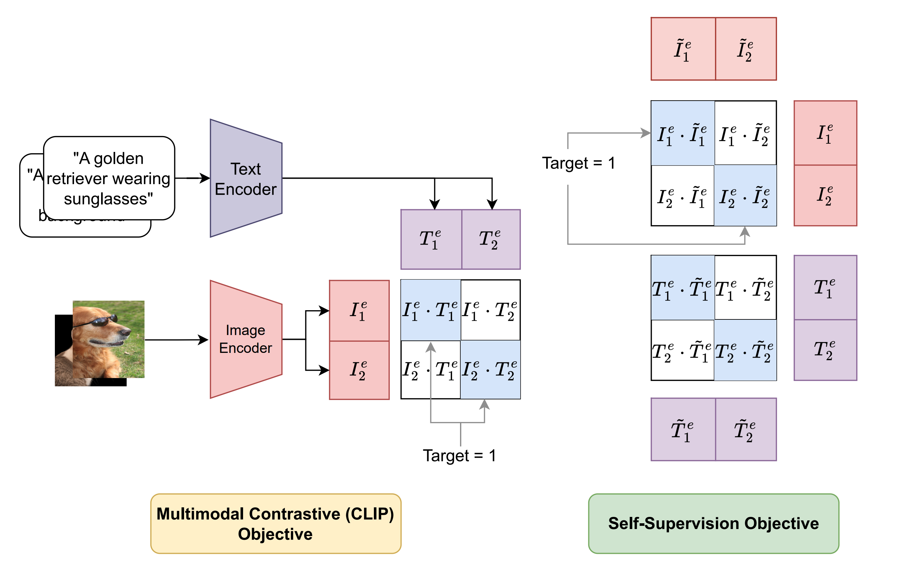

# CleanCLIP (ICCV 2023 Oral) &mdash; Official PyTorch Implementation

<h1 align="center"></h1>

This repository contains the official PyTorch implementation of the following **Oral (Top 1.8%) paper at ICCV 2023** and :trophy: **Best Paper at the [RTML workshop](https://rtml-iclr2023.github.io/) at ICLR 2023**:

> **CleanCLIP: Mitigating Data Poisoning Attacks in Multimodal Contrastive Learning**<br>
> Hritik Bansal* (UCLA), Nishad Singhi* (University of Tübingen), Yu Yang (UCLA), Fan Yin (UCLA), Aditya Grover (UCLA), Kai-Wei Chang (UCLA)<br>
> [https://arxiv.org/abs/2303.03323](https://arxiv.org/abs/2303.03323)
>
> **Abstract:** *Multimodal contrastive pretraining has been used to train multimodal representation models, such as CLIP, on large amounts of paired image-text data. However, previous studies have revealed that such models are vulnerable to backdoor attacks. Specifically, when trained on backdoored examples, CLIP learns spurious correlations between the embedded backdoor trigger and the target label, aligning their representations in the joint embedding space. Injecting even a small number of poisoned examples, such as 75 examples in 3 million pretraining data, can significantly manipulate the model's behavior, making it difficult to detect or unlearn such correlations. To address this issue, we propose CleanCLIP, a finetuning framework that weakens the learned spurious associations introduced by backdoor attacks by independently re-aligning the representations for individual modalities. We demonstrate that unsupervised finetuning using a combination of multimodal contrastive and unimodal self-supervised objectives for individual modalities can significantly reduce the impact of the backdoor attack. Additionally, we show that supervised finetuning on task-specific labeled image data removes the backdoor trigger from the CLIP vision encoder. We show empirically that CleanCLIP maintains model performance on benign examples while erasing a range of backdoor attacks on multimodal contrastive learning.*

## Acknowledgements

Some portions of the code in this repository are adaptations from the following repositories: [CyCLIP](https://github.com/goel-shashank/CyCLIP), [mlfoundations](https://github.com/mlfoundations/open_clip) and [openai](https://github.com/openai/CLIP).

## Licenses

You can use, redistribute, and adapt the material for non-commercial purposes, as long as you give appropriate credit by citing our paper and indicating any changes that you've made.

## Requirements
 
- Both Linux and Windows are supported, but we strongly recommend Linux for performance and compatibility reasons.
- 64-bit Python 3.7+ installation.

## Download the CC3M Dataset
1. wget https://storage.cloud.google.com/gcc-data/Train/GCC-training.tsv?_ga=2.191230122.-1896153081.1529438250
2. Run download.py -f GCC-training.tsv -d <directory_where_images_should_be_stored>

## Setup Environment and Install dependencies

### Clone the repository

```bash
git clone https://github.com/nishadsinghi/CleanCLIP.git
cd CleanCLIP
```

### Conda (recommended)

Please follow the instructions at the following link to set up anaconda: [Anaconda Setup](https://docs.anaconda.com/anaconda/install/index.html)

The following commands create a conda environment inside the repository with the dependencies.

```bash
conda env create --prefix ./env -f environment.yml
source activate ./env
```

### Pip

The requirements can be directly installed without creating a conda environment.

```bash
pip install -r requirements.txt
```

### Generating Poisoned Data
```
python -m backdoor.create_backdoor_data --train_data <path to train csv file> --templates data/ImageNet1K/validation/classes.py 
--size_train_data <total number of samples you want in the (pre-)training data> 
--num_backdoor <number of samples to be poisoned> 
--label <backdoor label, e.g., banana> 
--patch <type of backdoor trigger> 
--patch_location <location of the backdoor trigger> 
```


### Pre-Training 

```
python -m src.main --name exp1 
--train_data <path to (poisoned) train csv file> 
--validation_data <path to valid csv file> 
--image_key <column name of the image paths in the train/validation csv file> 
--caption_key <column name of the captions in the train/validation csv file> 
--device_ids 0 1 2 3 --distributed 
```
Your train/validation csv/tsv file should have 2 columns containing captions and the path to corresponding images on the machine. this script does not download the images for the captions directly. To download the images from their URL for CC3M and/or CC12M, use our `utils/download.py` script.


### CleanCLIP Finetuning 

```
python -m src.main --name cleanCLIP_finetuning 
--checkpoint <path to poisoned CLIP checkpoint .pt file> 
--device_id 0 
--batch_size 64 
--train_data <path to csv file containing clean finetuning data> 
--epochs 10 
--num_warmup_steps 50 
--lr 1e-5 
--inmodal 
--complete_finetune  
```

### Supervised Finetuning 

```
python -m src.main --name supervised_finetuning 
--finetune 
--device_id 0 
--epochs 10
--lr 1e-4
--num_warmup_steps 500
--checkpoint <path to poisoned CLIP checkpoint .pt file>
--backdoor_sufi
```


### Evaluation - ImageNet1K

Clean Accuracy:
```
python -m src.main --name <eval_imagenet_1k> --eval_data_type <dataset> --eval_test_data_dir data/ImageNet1K/validation/ --device_id 0 --checkpoint <ckpts/epoch_64.pt> 
```

Attack Success Rate:
```
python -m src.main --name <eval_imagenet_1k> --eval_data_type <dataset> --eval_test_data_dir data/ImageNet1K/validation/ --device_id 0 --checkpoint <ckpts/epoch_64.pt> --add_backdoor --asr --patch_type <type of backdoor trigger> --patch_location <location of backdoor trigger> --label <backdoor label> 
```


For ImageNet1K: There should be a labels.csv in the test data directory that contains 2 columns -- image, label. image should have the location to the image in the local machine.

## Pretrained Checkpoints

You can find the pre-trained checkpoints [here](https://drive.google.com/drive/folders/1kL6F3VuI6Loajks5h220anxfEBiSqz5Y?usp=share_link).
